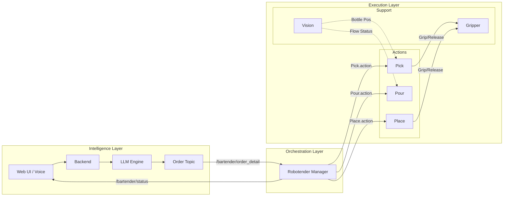

# Bartender Robot - System Architecture

This diagram represents the high-level architecture of the Bartender Robot system.



## How to use this diagram
- **Visualizing in VS Code:** Install the "Mermaid Preview" extension to see this diagram rendered directly in the editor.
- **Visualizing Online:** Copy the code block above and paste it into the [Mermaid Live Editor](https://mermaid.live/).
- **Live ROS 2 Equivalent:** While the system is running, you can see the "live" version of this flow by running:
  ```bash
  ros2 run rqt_graph rqt_graph
  ```


## How to use this diagram
- **Visualizing in VS Code:** Install the "Mermaid Preview" extension to see this diagram rendered directly in the editor.
- **Visualizing Online:** Copy the code block above and paste it into the [Mermaid Live Editor](https://mermaid.live/).
- **Live ROS 2 Equivalent:** While the system is running, you can see the "live" version of this flow by running:
  ```bash
  ros2 run rqt_graph rqt_graph
  ```
